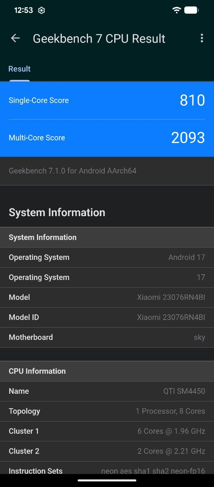
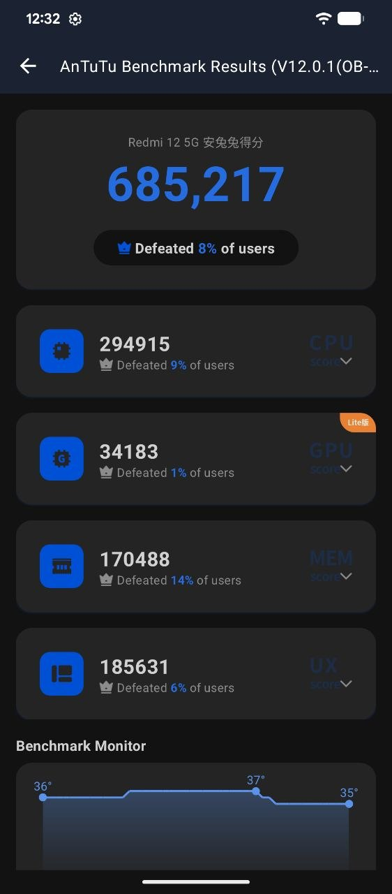

# performance

benchmarks on a redmi 12 5g, newest build on top.

## overview

| build | geekbench 7 single | geekbench 7 multi | antutu 12 |
|---|---|---|---|
| pixelos 17, 2026-10 | **810** | **2093** | **685,217** |

## pixelos 17, 2026-10

build `17.0-20260930-1940`

| antutu 12 | score |
|---|---|
| cpu | 294,915 |
| gpu | 34,183 |
| mem | 170,488 |
| ux | 185,631 |
| **total** | **685,217** |

geekbench 7.1.0, antutu v12.0.1. the antutu gpu test ran in its lite mode, so that number isn't comparable with full gpu runs.

  
  

