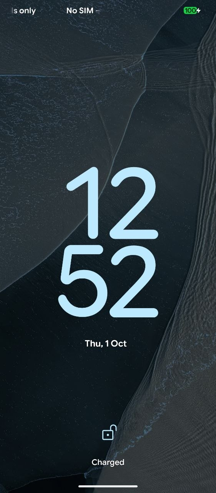
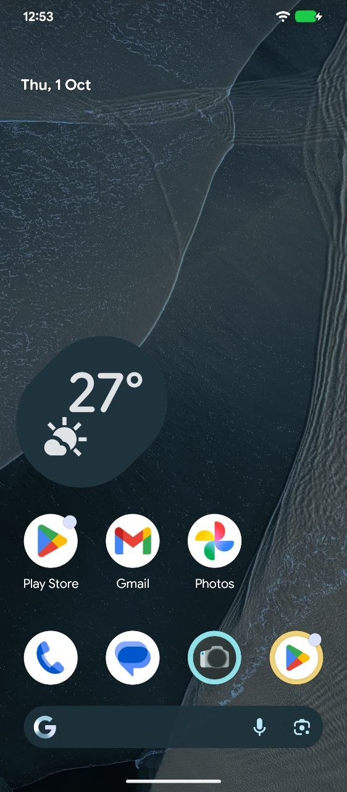
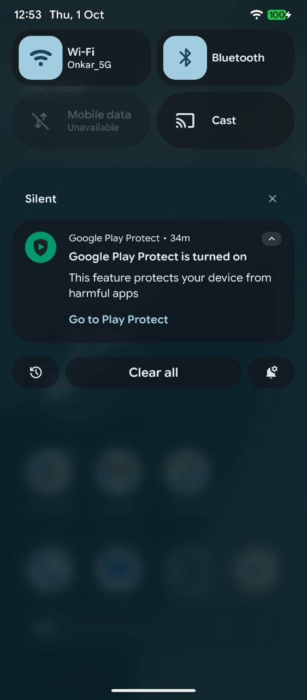
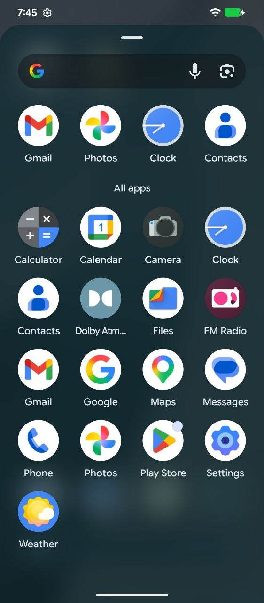
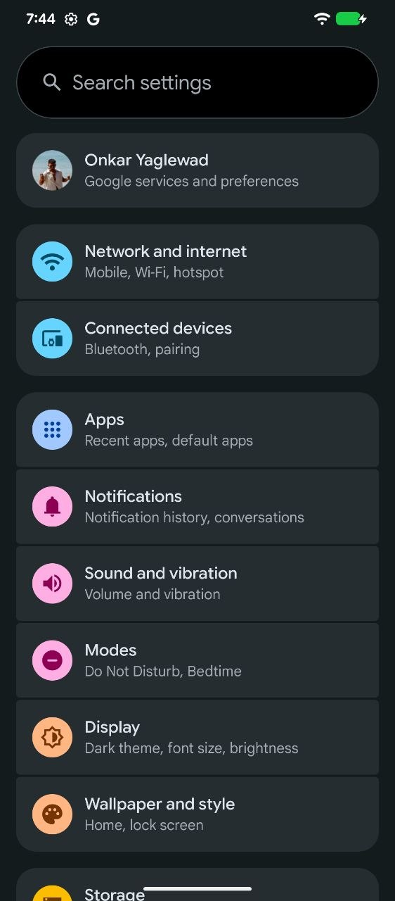
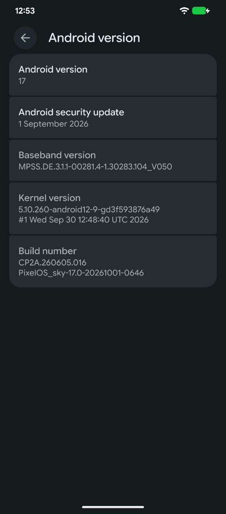

# pixelos 17 screenshots

build `17.0-20260930-1940`, on a redmi 12 5g.

## ui

<table>
  <tr>
    <td align="center"> lockscreen</td>
    <td align="center"> home</td>
    <td align="center"> quick settings</td>
  </tr>
  <tr>
    <td align="center"> app drawer</td>
    <td align="center"> settings</td>
    <td align="center"> android version</td>
  </tr>
</table>

## benchmarks

<table>
  <tr>
    <td align="center"> geekbench 7</td>
    <td align="center"> antutu 12</td>
  </tr>
</table>

scores in detail: [performance](../../docs/performance.md)

[back to the main page](../../README.md)
